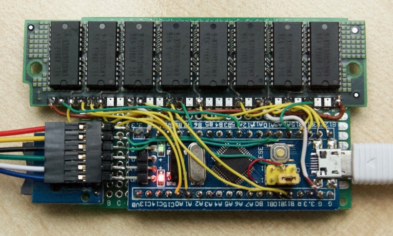
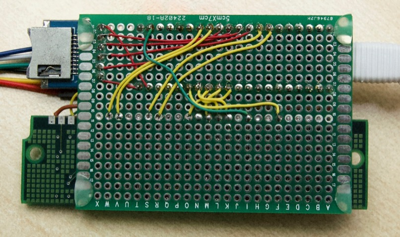

# DRAM on a Blue Pill

This project adds 16 MB memory to a Blue Pill, using up nearly all its I/O pins
(4 are left for an SD card, and UART/USB/SWD are also still free).

On each 1 ms systimer interrupt, 64 rows are auto-refreshed. This takes about
1% of the CPU time.

Writing one byte takes ≈ 2.1 µs and reading takes ≈ 1.8 µs, due to the bit
toggling / shifting / masking involved in getting all the  pins just right.

## Pinout

| Pin       | DRAM    | Description                      |
|:---------:|:-------:|----------------------------------|
| PB8..PB15 | D0..D7  | bi-directional data, 5V tolerant |
| PA0..PA3  | A0..A3  | 4 address bits                   |
| PB0..PB1  | A4..A5  | 2 address bits                   |
| PB2       | A6      | 1 address bit, also boot pin (!) |
| PB3..PB7  | A7..A11 | 5 address bits                   |
| PA8       | RAS-    | dram                             |
| PA15      | CAS-    | dram                             |
| PC13      | WR-     | dram + led                       |
| PA4..PA7  | -       | reserved for SPI to SD card      |
| PA9..PA14 | -       | reserved for UART/USB/SWD        |

The PB2 pin is used, which is not on the pin headers but on one of the BOOT
jumpers.  Unfortunately, the boot jumper has a 100 kΩ resistor in series, which
needs to be bypassed. In the images below this was done the hard way: by
scraping some copper bare on the top of the PCB and connecting a thin red wire
to it. Much easier would have been to short out the resistor on the underside
of the board.

## Top view

The 6-pin connection on the left is for a Black Magic Probe with serial + SWD.

## Bottom view

The µSD card adapter has been fitted but not connected yet.
