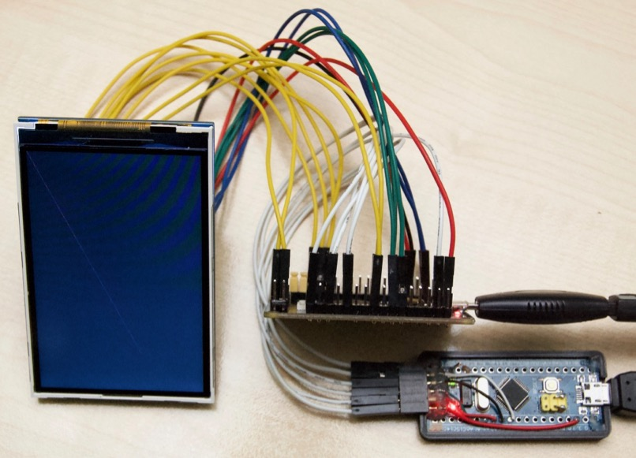
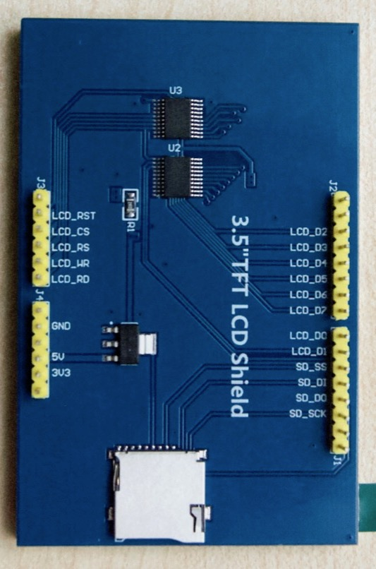
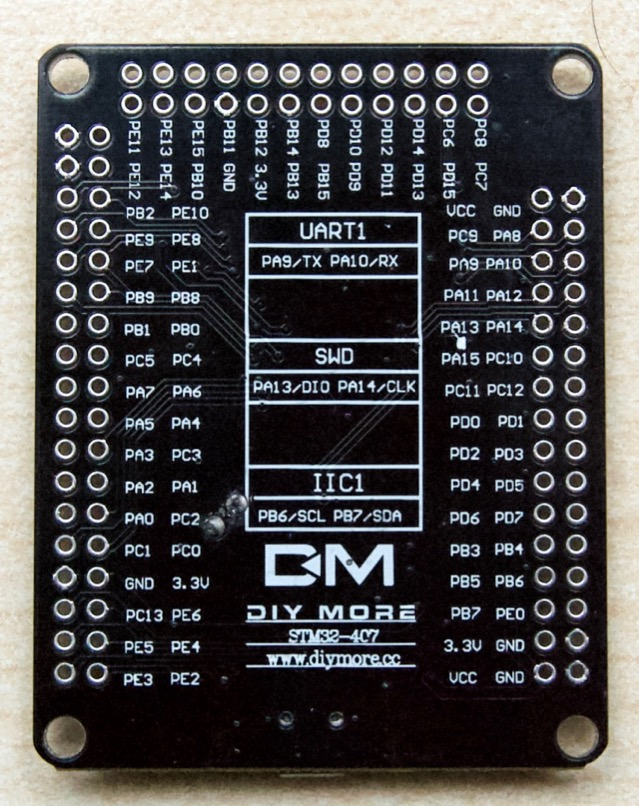
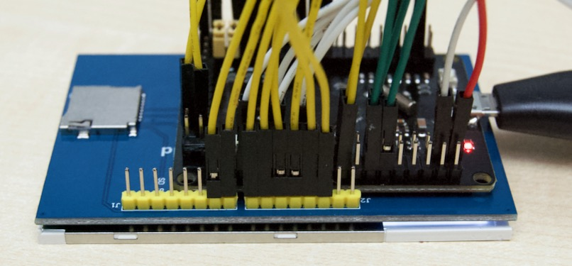

# 480x320 LCD

This is a demo of driving a 3.5" 480x320 LCD in 8-bit parallel mode.

The driver is in the [JeeH](https://git.jeelabs.org/jcw/jeeh) library,
it assumes the LCD has been mapped into the address space using the FSMC.
Due to the 8-bit parallel mode and the FSMC, redraws are quick: 20 ms.

Notes:

* The µSD card socket on the back of the LCD board has not been connected yet.
* The BMP only supplies 3.3V. The LCD needs 5V, supplied by second USB cable.

## BMP connections
* 1 = gnd
* 2 = pa14 swclk
* 3 = pa13 swdio
* 4 = pa10 rx1
* 5 = pa9 tx1
* 6 = +3.3v

## FSMC 8-bit wiring
* d0 = pd14
* d1 = pd15
* d2 = pd0
* d3 = pd1
* d4 = pe7
* d5 = pe8
* d6 = pe9
* d7 = pe10
* noe = pd4 (rd)
* nwe = pd5 (wr)
* ne1 = pd7 (cs)
* a20 = pe4 (rs)
* (a21) = pe5 (rst)

# Images

Here is the prototype setup:

This is the back side of that LCD, with an Arduino "shield" form factor:

This is the STM32F407VGT6 board used for this demo:

These boards would fit together quite nicely:

The µC is running at 168 MHz, the byte write rate to the LCD is about 16 MB/s.
