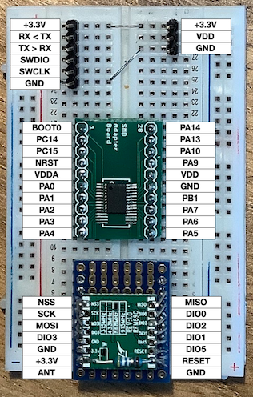

# Breadboard L031 with RFM69


```text
STM32   RFM69   BMP     Notes
======  ======  =====   =====
PA0     DIO0
PA1                     LED w/ 1 kΩ to GND
PA2             TX > BMP
PA3             RX < BMP
PA4     NSS
PA5     SCK
PA6     MISO
PA7     MOSI
PA9     DIO2
PA10    DIO3
PA13            SWDIO
PA14            SWCLK
PB1     RESET
```


