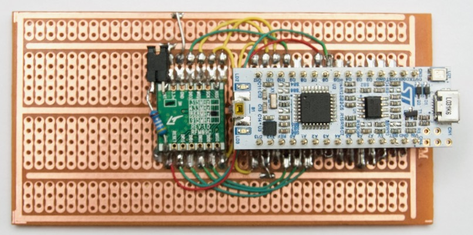

# Nucleo-32 with RFM69



```
Header  Nucleo  STM32   RFM69   Notes   RFM95?
======  ======  =====   =====   =====   ======
CN3-01  D1      PA9                     DIO1
CN3-02  D0      PA10                    DIO0
CN3-03  RESET   NRST                    
CN3-04  GND     -                       
CN3-05  D2      PA12                    DIO2
CN3-06  D3      PB0                     DIO3
CN3-07  D4      PB7                     DIO4
CN3-08  D5      PB6     DIO5            
CN3-09  D6      PB1     RESET           RESET
CN3-10  D7      PC14            OSC32   
CN3-11  D8      PC15            OSC32   
CN3-12  D9      PA8     DIO3            
CN3-13  D10     PA11    NSS             
CN3-14  D11     PB5     MOSI            
CN3-15  D12     PB4     MISO            
CN4-01  VIN     -                       
CN4-02  GND     -                       
CN4-03  RESET   NRST                    
CN4-04  +5V     -                       
CN4-05  A7      PA2             ST-Link       
CN4-06  A6      PA7                     NSS
CN4-07  A5      PA6                     MOSI
CN4-08  A4      PA5                     MISO
CN4-09  A3      PA4                     SCK
CN4-10  A2      PA3     DIO2            
CN4-11  A1      PA1     DIO1            
CN4-12  A0      PA0     DIO0            
CN4-13  AREF    -                       
CN4-14  +3V3    -                       
CN4-15  D13     PB3     SCK     LED     
```
